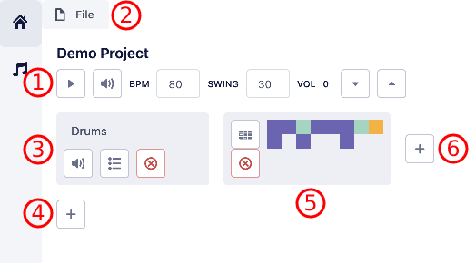

<h1 align="center">beets</h1>

    
     
    
    
    
    

Web-based DAW (Digital Audio Workstation) written in React for making music.

## Quick Start

The app can be accessed now at [beets.studio](https://beets.studio). While no account is necessary to begin using the app, functionality is limited.

1. Project name and controls for playing/pausing, muting, changing tempo, swing or global volume level.
2. Context menu for opening, saving, or updating project settings.
3. Track name and controls for muting, soloing or deleting. Tracks can be renamed in-line by clicking on the label. A track consists of one or more track sections `(5)`.
4. Button for adding a new track to the project.
5. Track section which contains sequencer steps. A track section can be between 1 and 64 steps and is added by the `+` button `(6)`.
6. Button for adding a new track section to the track.

## Features

-   Authentication
-   File uploads for samples
-   Workstation with tracks, a piano roll and step sequencer
    -   Drag & Drop to reorder tracks or sections
    -   Sampler instrument creation
    -   Keyboard shortcut `⌘S` to save the project
    -   Keyboard shortcut `⌘D` to duplicate track section(s) while selected
-   Project management (saving, opening, deleting)

## Issues

If you find a bug, feel free to [open up an issue](https://github.com/brandongregoryscott/beets/issues/new) and try to describe it in detail with reproduction steps if possible.

If you would like to see a feature, and it isn't [already documented](https://github.com/brandongregoryscott/beets/issues?q=is%3Aissue+is%3Aopen+label%3Aenhancement), feel free to open up a new issue and describe the desired behavior.

### Special thanks

-   [Tone.js](https://github.com/Tonejs/Tone.js)
-   [Evergreen](https://github.com/segmentio/evergreen)
-   [Supabase](https://github.com/supabase/supabase)
