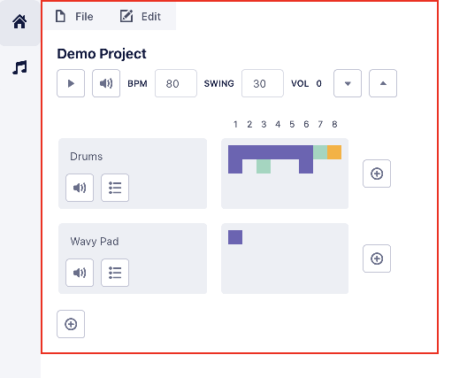
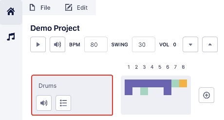
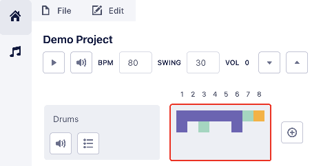

# Usage

This guide will serve as documentation for the various different pages and features of the application. If you find the information is lacking or inaccurate, or you'd like to propose a new section, [please open up an issue](https://github.com/brandongregoryscott/beets/issues/new) or [shoot me an email](mailto:contact@brandonscott.me). I'll do my best to respond and add documentation or assist where possible!

## Terms

I will reference various different terms in this document that will be defined here.

### Workstation page

-   Refers to the page on initial site load

### Workstation

-   Data structure that contains persisted entities that make up a song: a [Project](#project), [Tracks](#track), [Track Sections](#track-section), and [Track Section Steps](#track-section-step). A Workstation is not persisted, but acts as a 1:1 container to a [Project](#project)

### Project

-   Container for parts of a musical composition. Has a name, [BPM](#bpm), [swing](#swing) and global volume values.
-   Projects are private and only available for registered users.
-   Consists of one or more [Tracks](#track)

### Track

-   A layer that contains audio. Has a name, [mute](#mute), [solo](#solo), and [volume](#volume) values.
-   Consists of one or more [Track Sections](#track-section) which are collections of steps or notes of audio. See [Track Section Steps](#track-section-step) for more information.
-   Tracks can be based off of an [Instrument](#instrument), or simply used as a [Sequencer](#sequencer).
    -   This cannot currently be changed - you'll need to delete and create a new Track if you'd like to change it.

### Track Section

-   Collection of steps or notes of audio. Depending on the [Track](#track) type, these steps are added via the [Piano Roll](#piano-roll) or [Sequencer](#sequencer) dialogs.

### Track Section Step

-   A single step/note of audio. In an [Instrument](#instrument) type [Track](#track), these can be layered to form a chord. In a [Sequencer](#sequencer) type [Track](#track), up to 4 samples (usually drum sounds) can be layered per step index.

### Instrument

### Piano Roll

### Sequencer

### BPM

### Swing

### Volume

### Mute

### Solo
