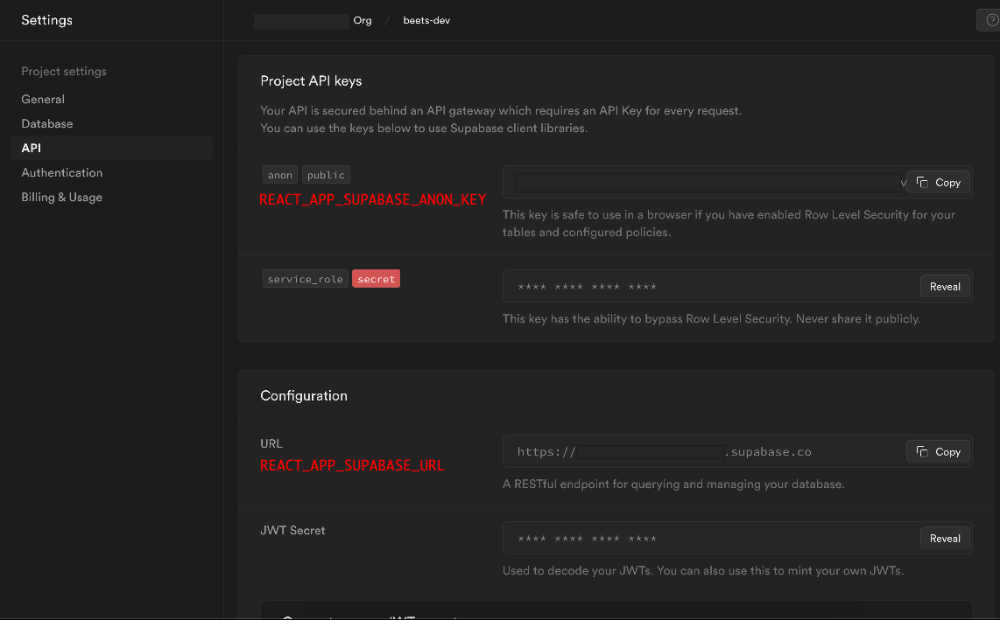
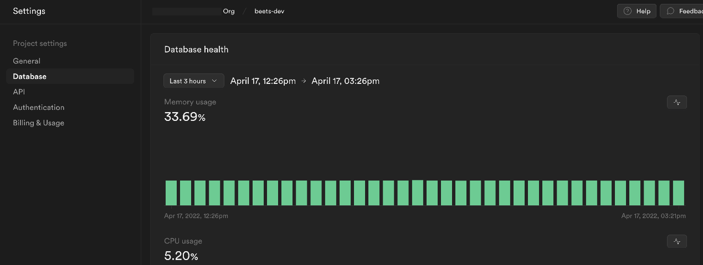
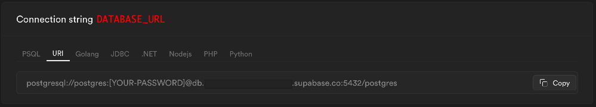
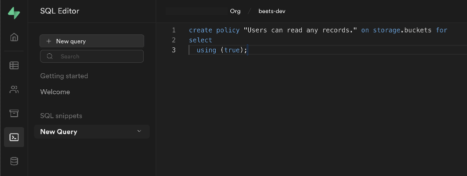
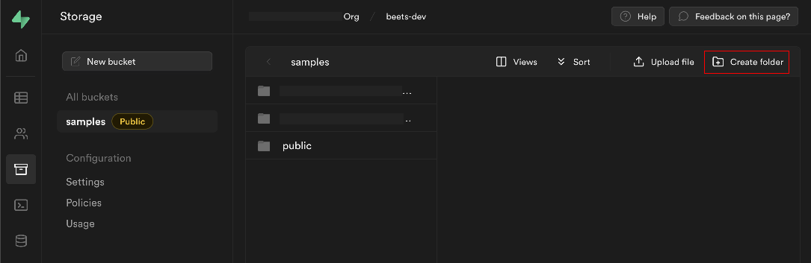
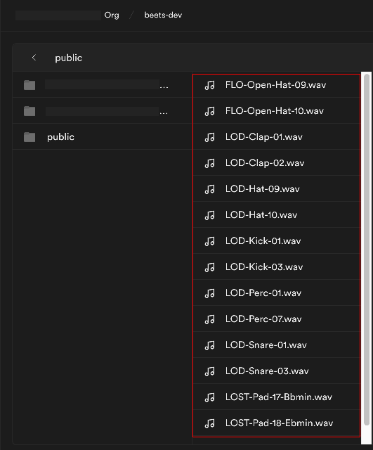

# Contributing

This section of the guide details how to setup the app for local development and contributing back. If you find the information is lacking or inaccurate, or you'd like to propose a new section, [please open up an issue](https://github.com/brandongregoryscott/beets/issues/new) or [shoot me an email](mailto:contact@brandonscott.me). I'll do my best to respond and add documentation or assist where possible!

## Table of Contents

-   [Getting Started](#getting-started)
    -   [Prerequisites](#prerequisites)
    -   [Fork and Clone](#fork-and-clone)
        -   [Branching and Deployments](#branching-and-deployments)
    -   [Install Dependencies](#install-dependencies)
    -   [Env File](#env-file)
        -   [REACT_APP_SUPABASE_ANON_KEY and REACT_APP_SUPABASE_URL](#react_app_supabase_anon_key-and-react_app_supabase_url)
        -   [DATABASE_URL](#database_url)
        -   [REACT_APP_SUPABASE_STORAGE_PUBLIC_URL](#react_app_supabase_storage_public_url)
    -   [Configuring File Storage](#configuring-file-storage)
        -   [Create Bucket and Policies](#create-bucket-and-policies)
        -   [Upload Public Samples](#upload-public-samples)
    -   [Migrating the Database](#migrating-the-database)
        -   [Run Migrations](#run-migrations)
    -   [Start the App](#start-the-app)

## Getting Started

This section outlines the steps to get the app running locally and pointing against your own instance of [Supabase](https://supabase.com/). [Supabase](https://supabase.com/) is a free, open-source alternative to Firebase and provides a hosted database and backend services that powers beets.

I have not had much luck with running a local version of Supabase with Docker, but this section of the guide may be updated in the future if this process becomes easier. For now, you'll need to create an account and configure a project for beets.

### Prerequisites

-   [`npm`](https://www.npmjs.com/) v7 and [`node`](https://nodejs.org/) v14.18 installed
-   [Supabase](https://supabase.com/) account

### Fork and Clone

To get started, [fork](https://github.com/brandongregoryscott/beets/fork) and clone the repo with `git`:

```
git clone git@github.com:{username}/beets.git && cd beets
```

#### Branching and Deployments

The [`main`](https://github.com/brandongregoryscott/beets/tree/main)/default branch of the repo holds the [production version](https://beets.studio) of the app, and is auto-deployed on merge via [Netlify](https://www.netlify.com/).

The [`development`](https://github.com/brandongregoryscott/beets/tree/development) branch of the repo holds the latest code that might not yet be deployed to production, is auto-deployed on merge, and can include new features, bug fixes, etc. It lives on the [development site](https://development.beets.studio), which connects to a separate [Supabase](https://supabase.com/) project from the production app.

> You're free to create an account and test out this version of the app, but I wouldn't keep any important files or data on it.

Generally speaking, for building out new features or fixing bugs, you should branch off of and PR into `development`.

### Install Dependencies

Install the app's dependencies using `npm`:

```
npm install
```

### Env File

To run the app locally, you'll need to ensure you have a [Supabase](https://supabase.com/) account with a project setup for beets. Configuration values to connect with your Supabase project are controlled with environment variables. Copy the sample `.env` and update the file to reflect your Supabase project's API key and URLs.

```
cp .env.sample .env
```

#### REACT_APP_SUPABASE_ANON_KEY and REACT_APP_SUPABASE_URL

Your Supabase API key (`REACT_APP_SUPABASE_ANON_KEY`) and URL (`REACT_APP_SUPABASE_URL`) can be found at `https://app.supabase.io/project/{your-project-id}/settings/api` and the page should look something like this:



#### DATABASE_URL

The database URL (`DATABASE_URL`) can be found at `https://app.supabase.io/project/{your-project-id}/settings/database` and the page should look like this:



The connection string can be copied from the bottom of the page.



#### REACT_APP_SUPABASE_STORAGE_PUBLIC_URL

The storage URL (`REACT_APP_SUPABASE_STORAGE_PUBLIC_URL`) is not found in the Supabase UI, but it should be easy to fill out once you've found your Supabase URL (`REACT_APP_SUPABASE_URL`). It follows the following format:

```
https://{your-project-id}.supabase.in/storage/v1/object/public
```

For example, if your `REACT_APP_SUPABASE_URL` is the following:

```
https://ef7c47561c6e47.supabase.co
```

The value for `REACT_APP_SUPABASE_STORAGE_PUBLIC_URL` should be:

```
https://ef7c47561c6e47.supabase.in/storage/v1/object/public
```

### Configuring File Storage

The file storage system provided by Supabase needs to be configured with a few SQL scripts that need to be run in the Supabase SQL editor.

#### Create Bucket and Policies

The SQL editor can be found at `https://app.supabase.io/project/{your-project-id}/sql` and the page should look like this:



These two scripts can be run in any order:

-   [Storage Bucket Policies](https://github.com/brandongregoryscott/beets/blob/main/src/scripts/storage_buckets_policies.sql)
    -   Creates the `samples` bucket
    -   Adds a [RLS (Row-Level Security)](https://supabase.com/docs/guides/auth/row-level-security) permission entry for anyone to read information from the `storage.buckets` table.
        -   More granular permissioning is added in the [Storage File Policies](https://github.com/brandongregoryscott/beets/blob/main/src/scripts/storage_file_policies.sql) script.
-   [Storage File Policies](https://github.com/brandongregoryscott/beets/blob/main/src/scripts/storage_file_policies.sql)
    -   Adds the following [RLS (Row-Level Security)](https://supabase.com/docs/guides/auth/row-level-security) permissions:
        -   Restricts file creation to authenticated users only.
        -   Restricts file deletion to the file's owner only.
        -   Restricts file reads to the file's owner OR for any file in the `public` directory, which is used to hold public samples for the demo project.

#### Upload Public Samples

There are a few samples that are provided in the `public` directory of the `samples` bucket to allow unauthenticated users to experiment with the demo project. These samples were purchased from [Samplified](https://samplified.us/) and should not be considered free - please go support them and purchase their packs if you like these sounds!

The samples that are currently available in the demo project/unauthenticated version of the app are located in the repo at [assets/public-samples](https://github.com/brandongregoryscott/beets/blob/main/assets/public-samples).

These samples can be uploaded in the Supabase UI. Navigate to the Storage section of your Supabase account at `https://app.supabase.io/project/{your-project-id}/storage` and click on your `samples` bucket created from the earlier steps.



From there, click the `Create Folder` button and enter the name `public`. This folder has special permissions so that anyone (even unauthenticated users) can read from it.

Once the folder has been created, click into it. You should be able to drag and drop the samples into this area to upload them.



### Migrating the Database

Database migrations are managed in code via [`node-pg-migrate`](https://salsita.github.io/node-pg-migrate). It uses the [DATABASE_URL](#database_url) environment variable to connect to your Supabase database.

#### Run Migrations

To ensure your database is up-to-date, there's an `npm` script that transpiles and runs the migration files found in [`src/scripts/migration`](https://github.com/brandongregoryscott/beets/tree/main/src/scripts/migrations).

```
npm run migrations:up
```

### Start the App

You should now be ready to run the app! In your terminal, run:

```
npm start
```
