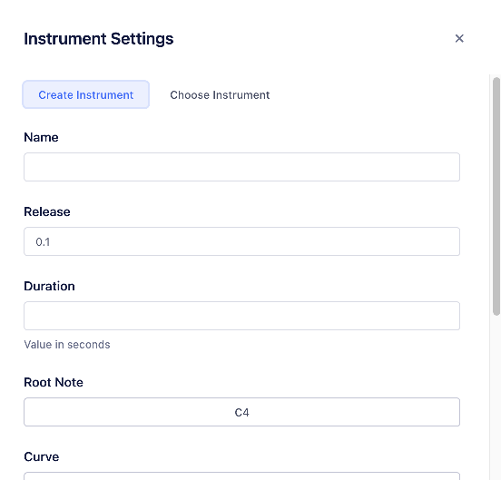

# How To

## Track

For additional information, see [Overview - Track](./overview#track)

### Creating a Track

-   To create a new [Track](#track), click the button below the [Track](#track) listing. You will be given the option of creating an [Instrument](#instrument) or [Sequencer](#sequencer) track.

### Naming a Track

-   To rename a [Track](#track), click into the editable label and enter the new name. You can hit the `ESC` key to cancel your changes.

## Instrument

For additional information, see [Overview - Sequencer](./overview#instrument)

### Creating an Instrument

-   To create a new [Instrument](#instrument), click the button below the [Track](#track) listing and select an [Instrument](#instrument) type. This will open a dialog that allows you to create a new [Instrument](#instrument) or choose an existing one to use for the [Track](#track).
    -   Note that only authenticated users have the ability to create new [Instruments](#instrument).

## Sequencer

For additional information, see [Overview - Sequencer](./overview#sequener)

### Adding Steps

1. To add steps, first select one or more samples from the dropdown menu.
   
1. Once at least one sample is selected, click on a tile. Up to 4 samples can be assigned to one tile.
   
    - If a sample has already been assigned to a tile, it will not be readded. However, any additional samples that are currently selected will be added to the tile when clicked.
1. To remove a sample, click on its name within the tile. You do not need to have any samples selected, and having samples selected will not add them to the tile when removing a sample.

    
