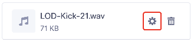
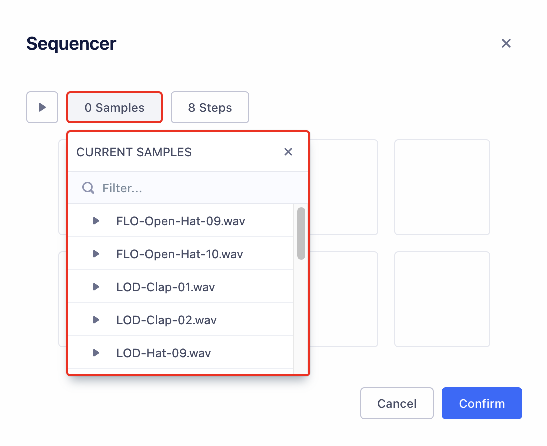
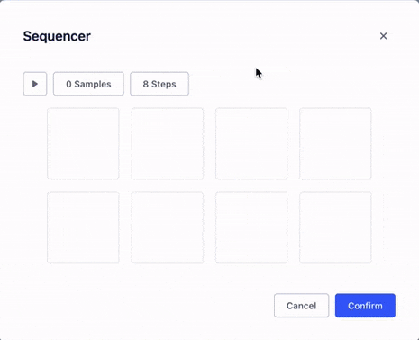

# How To

This section of the guide details individual features and functionality of the app. If you find the information is lacking or inaccurate, or you'd like to propose a new section, [please open up an issue](https://github.com/brandongregoryscott/beets/issues/new) or [shoot me an email](mailto:contact@brandonscott.me). I'll do my best to respond and add documentation or assist where possible!

## Workstation

### Export Project

-   To export the project as an audio file, open the [Export Dialog](#export-dialog) from clicking `File > Export`.

### Export Dialog

-   This dialog allows you to bounce a version of the project to a file. It takes into account the current project configuration (any [muted](./overview#mute) or [solo'd](./overview#solo) [Tracks](#track), [volume](./overview#volume), etc.)

-   Bouncing happens in real-time, and a file will be ready to download after the project has finished playing.

-   Currently supported file formats are `.wav`, `.webm`, and `.ogg`.

## File

### Renaming a File

-   To rename a [File](#file), click on the settings button in the [Library](./overview#library).

## Track

For additional information, see [Overview - Track](./overview#track)

### Creating a Track

-   To create a new [Track](#track), click the button below the [Track](#track) listing. You will be given the option of creating an [Instrument](#instrument) or [Sequencer](#sequencer) track.

### Naming a Track

-   To rename a [Track](#track), click into the editable label and enter the new name. You can hit the `ESC` key to cancel your changes.

### Moving a Track

-   To reorder a [Track](#track), hover over its card and drag the handle in the top right corner. The other [Tracks](#track) should reorder as you drag.

## Track Section

For additional information, see [Overview - Track Section](./overview#track-section)

### Creating a Track Section

-   To create a new [Track Section](#track-section), click the beside the [Track](#track).

### Moving a Track Section

-   To reorder a [Track Section](#track-section), hover over its card and drag the handle in the top right corner. The other [Track Sections](#track-section) should reorder as you drag.

### Duplicating a Track Section

-   To duplicate a [Track Section](#track-section), click on its card to select it. Select `Edit > Duplicate` or use the `⌘+D` keyboard shortcut to duplicate the selection. Multiple [Track Sections](#track-section) can be selected and duplicated at once.

## Instrument

For additional information, see [Overview - Instrument](./overview#instrument)

### Creating an Instrument

-   To create a new [Instrument](#instrument), click the button below the [Track](#track) listing and select an [Instrument](#instrument) type. This will open a dialog that allows you to create a new [Instrument](#instrument) or choose an existing one to use for the [Track](#track).
    -   Note that only authenticated users have the ability to create new [Instruments](#instrument).

## Sequencer

For additional information, see [Overview - Sequencer](./overview#sequener)

### Adding Steps

1. To add steps, first select one or more samples from the dropdown menu.
   
1. Once at least one sample is selected, click on a tile. Up to 4 samples can be assigned to one tile.
   
    - If a sample has already been assigned to a tile, it will not be readded. However, any additional samples that are currently selected will be added to the tile when clicked.
1. To remove a sample, click on its name within the tile. You do not need to have any samples selected, and having samples selected will not add them to the tile when removing a sample.

    
