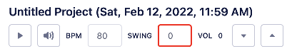

# Overview

This guide will serve as high-level documentation for the various different pages and features of the application. If you find the information is lacking or inaccurate, or you'd like to propose a new section, [please open up an issue](https://github.com/brandongregoryscott/beets/issues/new) or [shoot me an email](mailto:contact@brandonscott.me). I'll do my best to respond and add documentation or assist where possible!

### Workstation page

-   Refers to the page on initial site load. This page holds audio controls and UI components for building out your project.

### Workstation

-   Data structure that contains persisted entities that make up a song: a [Project](#project), [Tracks](#track), [Track Sections](#track-section), and [Track Section Steps](#track-section-step). A Workstation is not persisted, but acts as a 1:1 container to a [Project](#project)

### Project

-   Container for parts of a musical composition. Has a name, [BPM](#bpm), [swing](#swing) and global [volume](#volume) values.
-   Projects are private and only available for registered users.
-   Consists of one or more [Tracks](#track)

### Track

-   A layer that contains audio. Has a name, [mute](#mute), [solo](#solo), and [volume](#volume) values.
-   Consists of one or more [Track Sections](#track-section) which are collections of steps or notes of audio. See [Track Section Steps](#track-section-step) for more information.
-   Tracks can be based off of an [Instrument](#instrument), or simply used as a [Sequencer](#sequencer).
    -   This cannot currently be changed - you'll need to delete and create a new Track if you'd like to change it.

### Track Section

-   Collection of steps or notes of audio. Depending on the [Track](#track) type, these steps are added via the [Piano Roll](#piano-roll) or [Sequencer](#sequencer) dialogs.

### Track Section Step

-   A single step/note of audio. In an [Instrument](#instrument) type [Track](#track), these can be layered to form a chord. In a [Sequencer](#sequencer) type [Track](#track), up to 4 samples (usually drum sounds) can be layered per step index.

### Instrument

-   A persisted configuration for a sampled instrument. This allows you to set the root note, its duration, the release time, and curve of the sample.
-   Samples that are configured as instruments can be pitched up or down in the [Piano Roll](#piano-roll) component, whereas standard [Sequencer](#sequencer) [Tracks](#track) cannot be.

### Creating an Instrument

-   To create a new [Instrument](#instrument), click the button below the [Track](#track) listing and select an [Instrument](#instrument) type. This will open a dialog that allows you to create a new [Instrument](#instrument) or choose an existing one to use for the [Track](#track).
    -   Note that only authenticated users have the ability to create new [Instruments](#instrument).

### Piano Roll

-   Dialog that can be used to program in [Track Section Steps](#track-section-step) for an [Instrument](#instrument) type [Track's](#track) [Track Section](#track-section). It can be opened by hovering over a [Track Section](#track-section) and clicking the middle button:

    

    

### Sequencer

-   Dialog that can be used to program in [Track Section Steps](#track-section-step) for a given [Track Section](#track-section). It can be opened by hovering over a [Track Section](#track-section) and clicking the middle button:

    

    

#### Adding Steps

1. To add steps, first select one or more samples from the dropdown menu.
   
1. Once at least one sample is selected, click on a tile. Up to 4 samples can be assigned to one tile.
   
    - If a sample has already been assigned to a tile, it will not be readded. However, any additional samples that are currently selected will be added to the tile when clicked.
1. To remove a sample, click on its name within the tile. You do not need to have any samples selected, and having samples selected will not add them to the tile when removing a sample.

    

### BPM

-   Stands for _beats per minute_ or the tempo of the song. This is persisted as a property on the [Project](#project).

### Swing

-   Value from 0 - 100 that controls how far notes will deviate from the metronome. This can be used for an 'off-beat' sound commonly used in hip-hop.

### Volume

-   Value (in decibels, or dB) that controls how quiet or loud the audio is. The [Project](#project) has a global volume level, and each [Track](#track) will eventually have its own volume level to allow for mixing. (See [beets#68](https://github.com/brandongregoryscott/beets/issues/68))

### Mute

-   Controls whether or not the audio is playing. The whole [Project](#project) can be muted, and individual [Tracks](#track) can be muted to play certain parts together.

### Solo

-   Plays a specific [Track](#track) alone. This may be easier than muting all other [Tracks](#tracks) in a [Project](#project) to listen to just one part.

